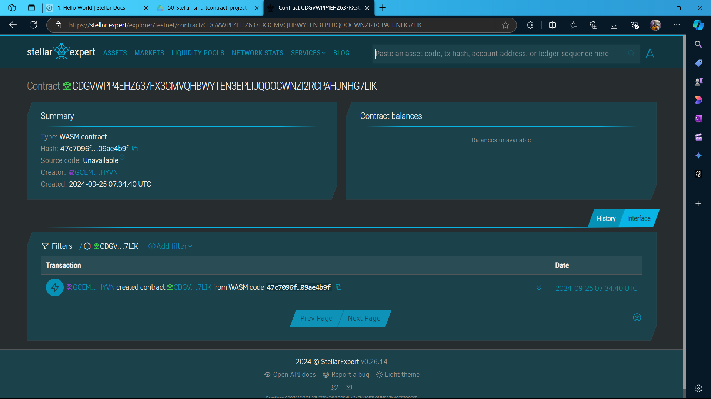

##### Deployed smartcontract address: CC4HE6NOZLQWG65HXUOTFRXZ7QA3VEIJIHNGCMBHENU6RHYIA2XDIOP2

# Crypto-based Subscription Service

## Project Title
Crypto-based Subscription Service

## Project Description
The Crypto-based Subscription Service is a platform that allows users to manage subscription services using Lumens (XLM) for payments. The platform leverages blockchain technology and smart contracts to automate subscription creation, billing cycles, and access control, ensuring transparency, efficiency, and a seamless experience for both users and service providers.

## Project Vision
The vision of this project is to revolutionize the subscription-based model by utilizing the Stellar blockchain to offer secure, transparent, and automated payments. By eliminating intermediaries, it aims to empower service providers and subscribers with full control over their transactions while reducing costs and improving transaction speed.

## Key Features
- **Subscription Creation**: Smart contracts allow service providers to create subscription plans with predefined billing cycles.
- **Automated Billing**: Subscriptions are managed automatically, with Lumens (XLM) deducted from the subscriber’s account at the start of each billing cycle.
- **Access Control**: Subscribers gain access to services automatically upon successful payment, and access is revoked if a payment fails.
- **Transparency and Security**: All transactions are recorded on the Stellar blockchain, ensuring transparency, immutability, and security.
- **Low Transaction Fees**: Leverages Stellar’s low-cost transactions, making it cost-effective for frequent micropayments.
